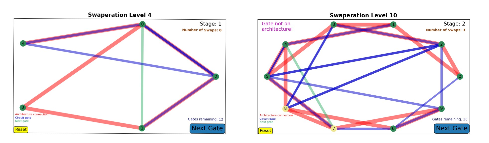

# Swaperation

**A quantum game for solving the qubit routing problem.**

This was completed as part of a project completed by Cohort 6 at the [Quantum Engineering Centre for Doctoral Training, University of Bristol](http://www.bristol.ac.uk/quantum-engineering/), in the 2019/2020 academic year.

## About the Game

The purpose of the game is to rewrite a quantum circuit so that it can be run on a given architecture.

Players can click on the nodes of the interactive graph to swap qubits, which corresponds to relabelling qubits or adding swap gates to the circuit.

The score is determined by how many additional swap gates you added in order to make the circuit runnable on the architecture.

The game outputs a final quantum circuit (via `qiskit`) which can be directly ran on the given architecture.




## How to Play

To play the game you can either clone the repository and directly run the levels via e.g.

```
python level_3.py
```

or you can run the `jupyter` notebooks, e.g. using [this binder link](https://mybinder.org/v2/gh/jenjaminbones/qgame/master) to play in the browser.


### Instructions

The goal is to make the circuit (blue lines) able to be run on the given architecture (red lines). 
This is accomplished when all two-qubit circuit gates (blue line) lie on top of an architecture connection (red line). 

Once you start the game (via e.g. `python level_3.py` or in one of the notebooks), an interactive plot will appear. 
The game contains two main stages, in both of which the player can click on nodes to swap them.

* **Stage 1**: You can swap any two nodes as many times as you like. This corresponds to relabelling the circuit qubits.
 Because these swaps incur no penalty, it's a good idea to get the circuit as close as possible to lying on the architecture at this stage.
 This corresponds to trying to make all the blue lines lie on top of the red lines. When you are happy, you can click the "Next Gate" button to progress onto the next stage.

 * **Stage 2**: Here the game will cycle over the edges. If the current gate (green line) is lying on top of an architecture connection,
 you can press "Next Gate" to confirm that gate and move onto the next one. If it is not currently lying on any red edge, you must swap more nodes so that it is lying on top of a red edge.
 Each swap incurs a penalty of one point, and will determine your score at the end of the game!

 When all the gates have been cycled over, the game is finished. The outputs of the game are the new circuit, the initial mapping, and the number of swaps used. 

See the `How to Play.ipynb` notebook for a more detailed explanation.

## Repository layout

The main code is in `game.py`.  There is a `Game` class which
is mainly composed of `plot`, which renders the current game as an interactive plot, and `onClick`,
which performs the updates when a node or edge is clicked.

The `How to Play.ipynb` notebook contains an explanation of how to play the game.

All the current levels can be found in the `levels` folder, which contains both raw python files (to be ran as `python level_1.py`)
and `jupyter` notebook versions.

The `benchmarking` folder contains some notebooks explaining how the output of the game can be ran on real IBMQ devices. To run these, you'll need to have an IBMQ account: you can sign up here
[https://quantum-computing.ibm.com/](https://quantum-computing.ibm.com/). These notebooks run examples on 5, 10 and 15 qubits, showing that the game really engages with a problem called the _qubit routing problem_. We compare
some game outputs against `qiskit` methods and show that we can occasionally improve upon their out the box method.

There are some tests in the `tests` folder, this is mainly used to check that the output data to the game is as we expect.
There are functions here to generate game output and process it, confirming that the input and output circuit are equivalent and that
the output circuit only contains gates native to the architecture.

There are some useful functions in `util.py`.

`requirements.in` and `requirements.txt` are used to create the binder notebooks. 

## Other things to note

* If you want to clone the repo and play locally, then `numpy`, `qiskit`, `networkx` and `matplotlib` are all prerequisites.

* You can save the game output by passing the `output_dir` and `output_filename` parameters to the game object.

* The architecture graph can contain more qubits than the input circuit.

* Circuits that include measurements (or anything that's not a gate) will most likely cause errors. Best to play the game with the circuit and add the measurements after.

* We do not simplify the circuits at all, even in the final circuit. This is a shortcoming, as there may be gates that natually cancel at this point.

* You need to run e.g. `g = Game(...)` instead of just `Game(...)`. This is so that `python` saves the object. 


## The science behind the game

Quantum circuits are usually designed with the assumption that a two-qubit gate could be applied on any two qubits.
In reality, real devices have limited connectivity, and so circuits must be recompiled. This usually involves swapping qubits
(via 3 CNOT) gates until the relevant qubits are now adjacent. See [this recent paper](https://arxiv.org/abs/1902.08091) for a more in-depth explanation. We can formalise the problem as follows: 

Inputs:

* A quantum circuit.
* An architecture connectivity graph.

Outputs:

* A new circuit
* An (initial) qubit labelling.
* Score (number of swaps).

Such that:

* The new circuit can be directly implemented on the architecture (no further swaps required).
* The new circuit has the same effect as the original circuit.

By playing _Swaperation_, you can engage with this problem by manually choosing how to perform each gate -- 
you cannot complete the level until all gates have been allocated! The output circuit can then be ran directly on a quantum computer,
see the notebooks in `benchmarking` for examples.

# Miscellaneous

For any questions or queries related to this game, please use the following email address: benjamin (dot) jones (at) bristol.ac.uk.

Suggestions or contributions would be more than welcome! Feel free to highlight issues or make pull requests.


Please also check out two other games created by Cohort 6 at the QECDT in Bristol:
* [_Zedex_](https://github.com/qecdt-cohort6/zedex), playable [here](https://de-luxham.github.io/web/basic_rules.html): A quantum game for optimising circuits with the ZX calculus.
* [_Squamble_](https://github.com/qecdt-cohort6/squamble), playable [here](https://naomisolomons.github.io/index_v2.html): A game for exploring quantum probability flows on graphs. 


© 2020
